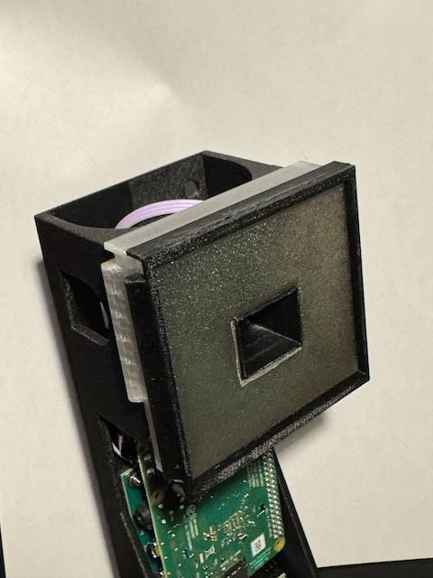
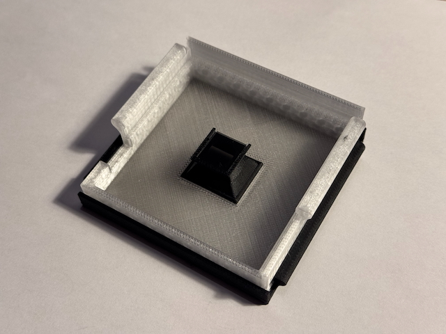
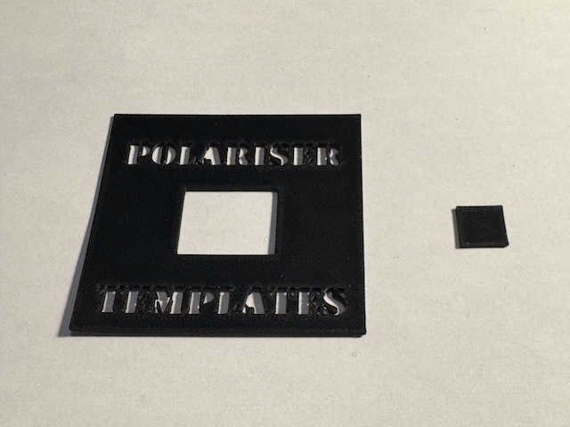

# Enhanced Diffuser (Classic)

This is an enhanced version of the diffuser for the OpenScan Classic.  The design has three main improvements:
* The rectangular cut-out is sized correctly for the Arducam IMX519 16MP camera that at the time of writing was the default choice for the OpenScan Classic.
* A camera shade is provided to prevent light reflecting from the diffuser entering the camera from oblique angles, resulting in wash-out.
* Holders are provided for the polarising filters to secure them in place.

In addition, templates are provided to help cut the polarising filter material to the right sizes.

|  |
|:--:|
| The whole assembly, shown installed. |

|  |
|:--:|
| The rear of the assembly, showing the camera shade with one of the two polarising sheets installed at its rear. |

|  |
|:--:|
| The two templates for cutting down polarising film to the correct dimensions. |

## Printing

The diffuser should be printed in an uncoloured translucent filament such as PETG.  The camera shade should be printed in a matte black material - it was tested with Bambu PETG-CF.  Other parts can be printed in whatever material takes your fancy, although they have only been tested in the same black PETG-CF that was used for the camera shade.  A textured build plate produces a nice rough texture on the face of the diffuser and is fine for all other parts too.  No support is required.

The design has been tested using Bambu Studio to slice before printing on a Bambu X1C with an 0.4mm nozzle and the Textured PEI build plate.  The 3MF file used to print it is included in this folder, along with a STEP file, STLs for each part plus the assembly as a whole, and the Fusion 360 source.

## Assembly

Unlike the original diffuser, which could be slid onto the camera enclosure from the top, this version clips onto the front of the enclosure, but uses the same rails.  No modifications to the enclosure are required.

To assemble the diffuser, insert the camera shade through the rectangular hole in the front and clip it into place - if you intend to use polarisers, make sure that the slot at the back of the camera shade is pointing upwards.  To install the polarisers, first cut out the correct profiles from a sheet of polarising plastic - printable templates are provided to help with this.  Make sure you cut out the rectangular hole in the larger sheet so that it fits around the outside of the camera shade, and make sure that the two filters are cut from one sheet of polarising material, without any rotation of the material between them.

Place the large sheet of polariser on the _front_ of the diffuser and use the large retaining clip to secure it in place.  Then place the small sheet into the slot at the back of the camera shade.

The small polariser is square, allowing it to be inserted into its holder in more than one orientation.  Make sure that it is oriented correctly by clipping the diffuser onto the OpenScan enclosure and placing a reflective plastic object in front of the camera - the lid of an aerosol can, maybe.  Launch the OpenScan web app on your computer (by browsing to http://openscan or http://openscan.local) and click "scan" to preview the live images from the camera.  Rotate the small polariser by one quarter turn and see which of the two orientations minimises the reflections as seen in the live preview.  When you have identified the right orientation, you can secure the small polariser with a dab of glue, if you wish.
