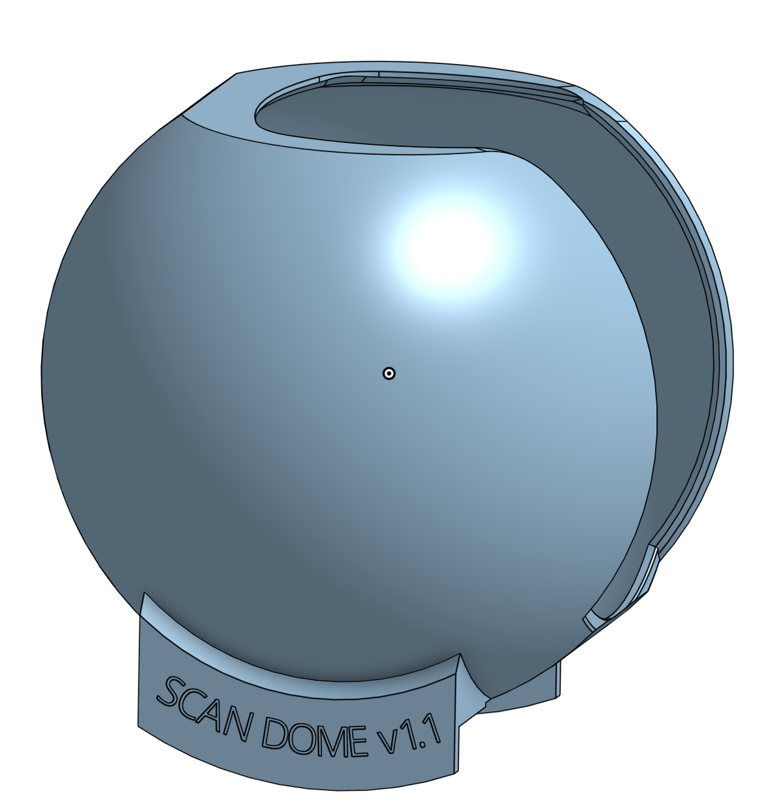
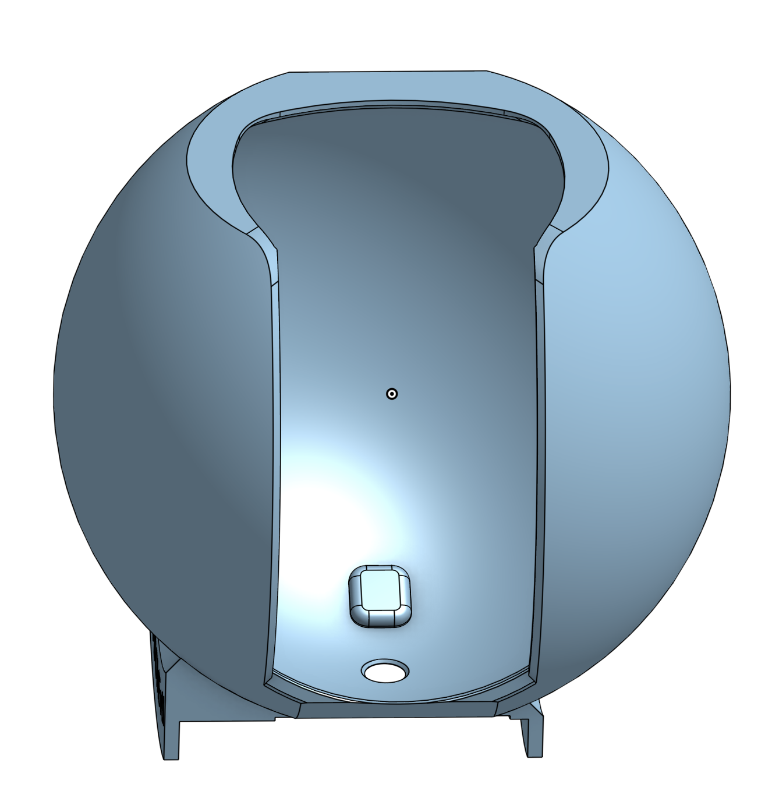
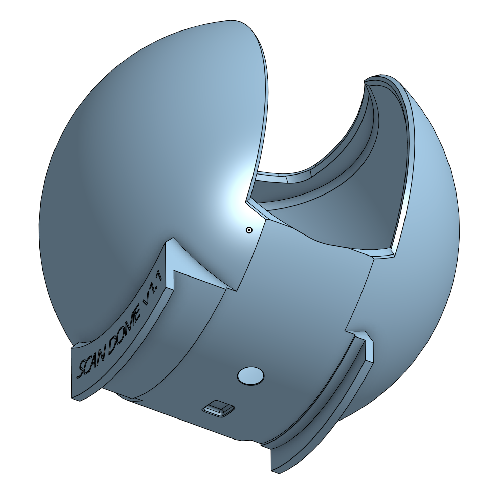
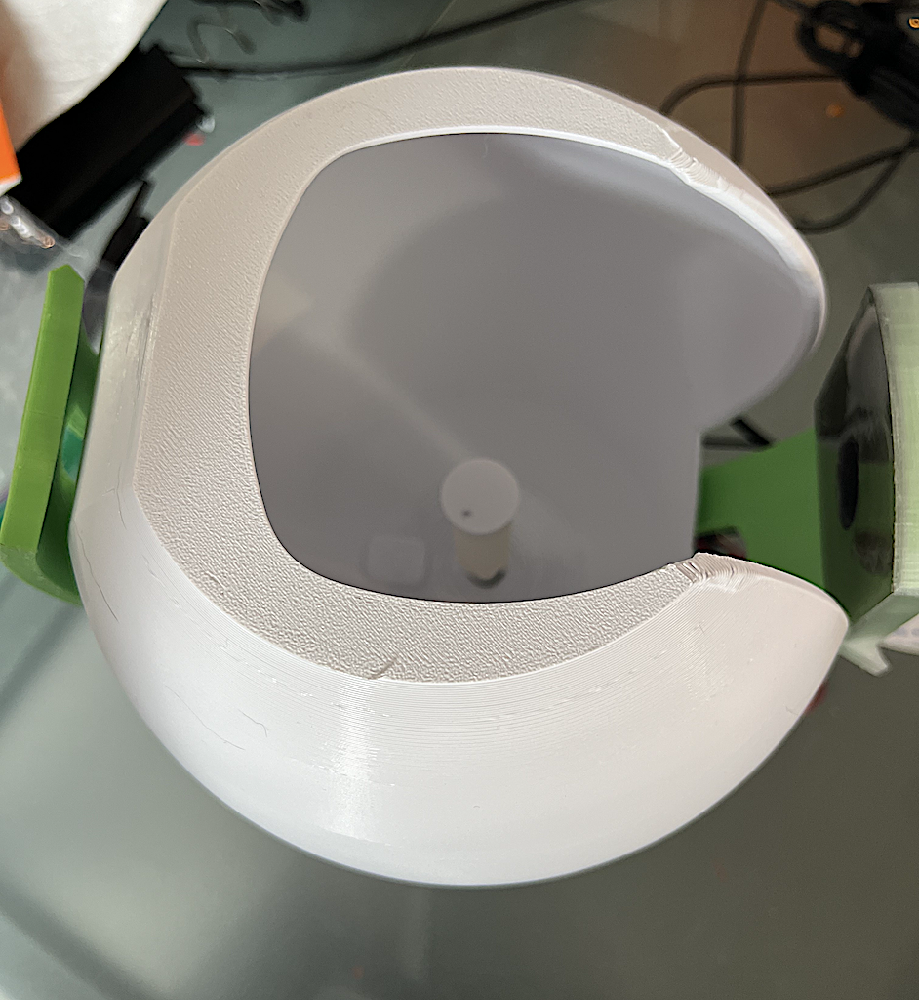

# ScanDome v1.1

Block out a noisy background for cleaner scans.  This is specifically built for the OpenScan Mini v1.

## Design

The ScanDome sits freely on the base of the OSMini v1. The rotor will freely rotate around the ScanDome. The camera and ring light will fit comfortably through the opening.  No modification to the OSMini v1 is necessary and the ScanDome may be removed and replaced freely.

## Printing

Print on the flat surface on the top of the ScanDome (i.e., upside down from the intended deployment position).

Support is not strictly necessary but will improve the print quality around the hole for the turntable servo.  Low infill and low number of walls recommended -- this is not a structural part.

## Real Example

Printed in Inland White PLA+.

## Extending

This was designed in OnShape.  Feel free to make a copy yourself and change it to suit your needs.

[https://cad.onshape.com/documents/bbc5671350f2efceec423882/w/e5e7f9a0af473f2fc05592b5/e/c94886a7ce4cdc3cb071335e](https://cad.onshape.com/documents/bbc5671350f2efceec423882/w/e5e7f9a0af473f2fc05592b5/e/c94886a7ce4cdc3cb071335e)
