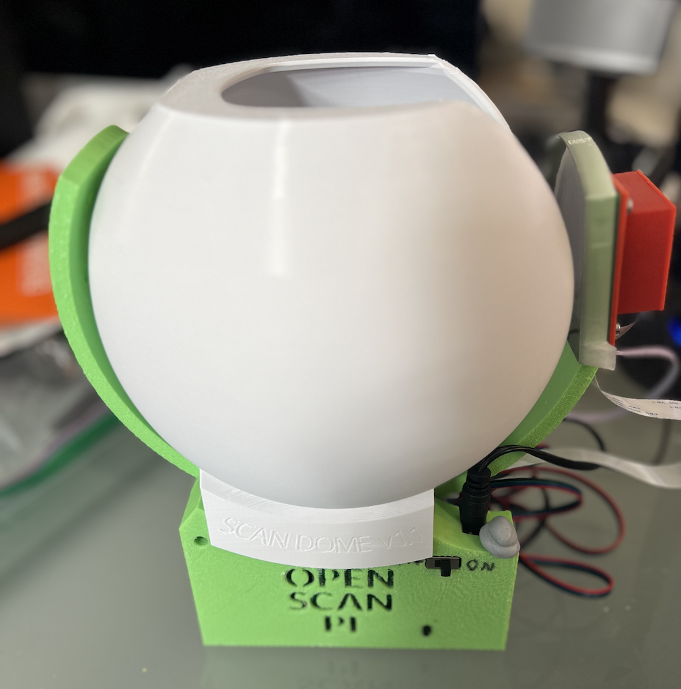
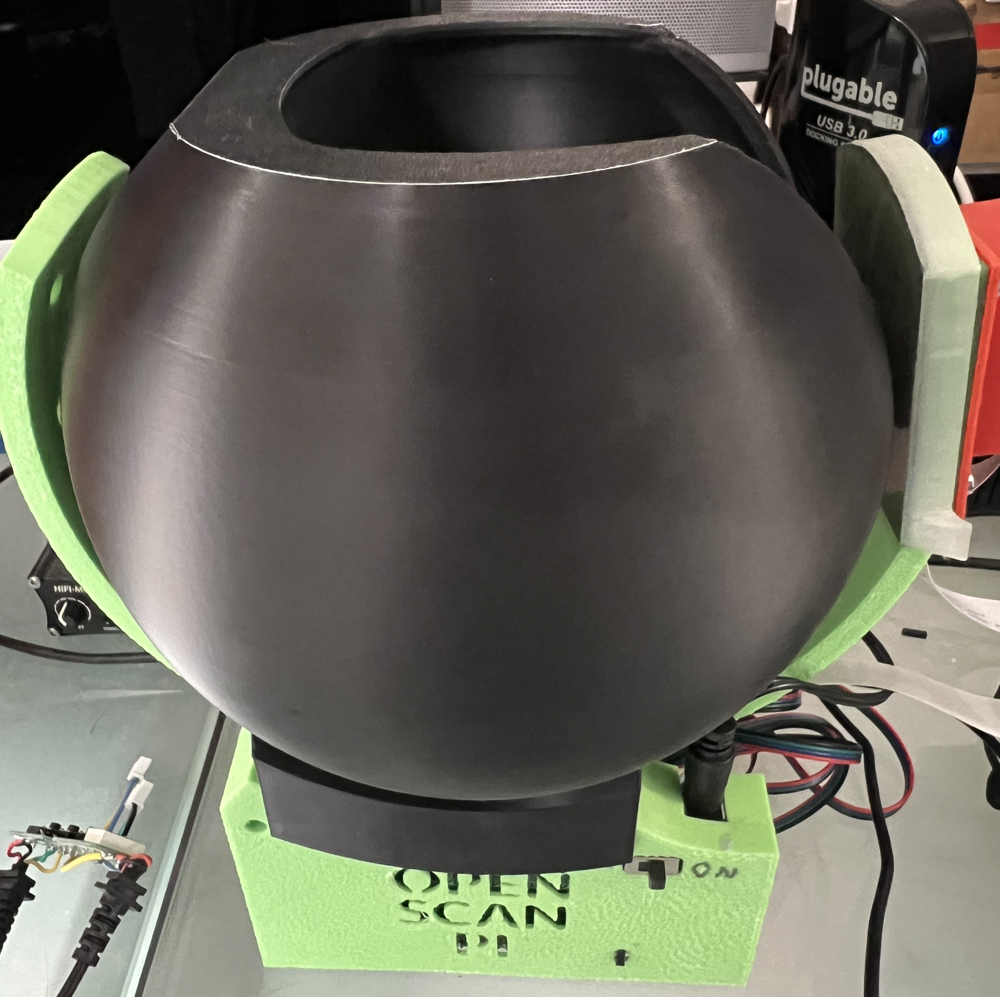
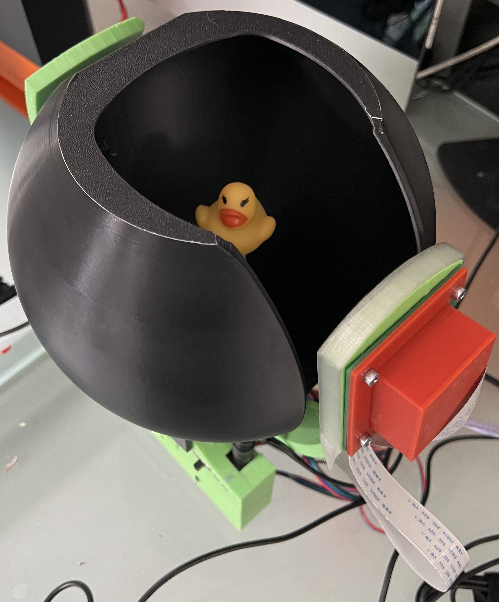

# ScanDome v1.2

Block out a noisy background for cleaner scans.  This is specifically built for the OpenScan Mini (Classic) v1.

## Design

The ScanDome sits freely on the base of the OSMini (Classic) v1. The rotor will freely rotate around the ScanDome. The camera and ring light will fit comfortably through the opening.  No modification to the OSMini (Classic) v1 is necessary and the ScanDome may be removed and replaced freely.

## Printing

Print on the flat surface on the top of the ScanDome (i.e., upside down from the intended deployment position).  The v1.2 version is positioned correctly so you can just import to your slicer directly and it will be correctly oriented.

Support is not strictly necessary but will improve the print quality around the hole for the turntable servo.  Low infill and low number of walls recommended -- this is not a structural part.

## Real Example

v1.1 Printed in Inland White PLA+.

v1.2 Printed in Polyterra Polylite Black ABS (No Supports).

## Extending

This was designed in OnShape.  Feel free to make a copy yourself and change it to suit your needs.

v1.1: [https://cad.onshape.com/documents/bbc5671350f2efceec423882/w/e5e7f9a0af473f2fc05592b5/e/c94886a7ce4cdc3cb071335e](https://cad.onshape.com/documents/bbc5671350f2efceec423882/w/e5e7f9a0af473f2fc05592b5/e/c94886a7ce4cdc3cb071335e)

v1.2: [https://cad.onshape.com/documents/bbc5671350f2efceec423882/w/e5e7f9a0af473f2fc05592b5/e/39974ac23446baa6102c6c2a](hhttps://cad.onshape.com/documents/bbc5671350f2efceec423882/w/e5e7f9a0af473f2fc05592b5/e/39974ac23446baa6102c6c2a)

## Change Log

### Version 1.2
* Removed engraved text and version number
* reoriented print direction
* opened up hole for second servo shaft

### Version 1.1
* Initial public release

## Author

Ben Gemperline (@advisoray).  Donated to the OpenScan project.